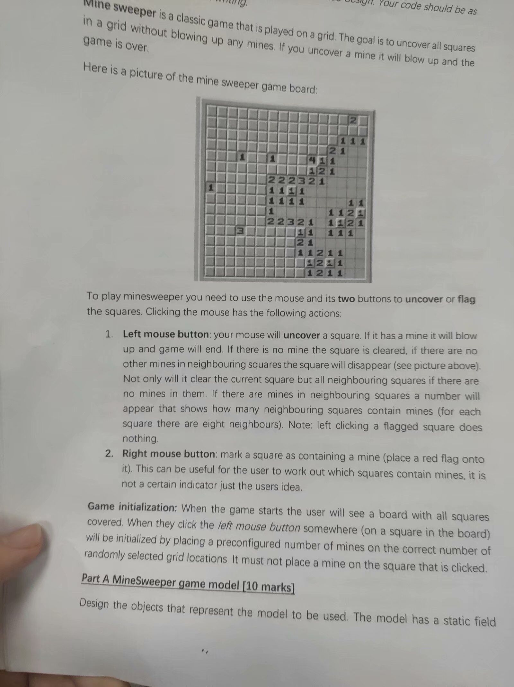

# CS209A-Java2
SUSTech course "Computer System Design and Analysis" codes repository

Taught by Adam Ghandar

Don't you like Minesweeper and Magic Square? 🐶

If this repository DO help you, please give me a **STAR**:star:!

The code is just for reference, **Plagiarism** is not recommended.

It seems that Adam is leaving, so the exam information here may be not so helpful.

The project code of my group is released here: [magic-square](https://github.com/quantum-square/magic-square).

## Midterm

Handwritten Minesweeper! 40 of 100 points!

See the picture below from a classmate! Keep secret!

## Final Exam

刚刚考完，这部分跟你们细说：

Question 1: 20道不定项选择，每题两份，印象里有mocking、batching的概念考察，还问了什么样的问题适合用heuristic而不用数学的优化问题去解（这特么咋选555）

Question 2: 10道判断题TF

Question 3: 写个猜数字的java程序，要求足够接近真实java代码

Question 4: JokeSocket，手写socket，裂开，还好打印了lab的socket编程的代码（第一问实现protocol本身，第二问写server，第三问写client）

Question 5: regex，考的需要我们匹配一个规定email的正则表达式，最后一节课讲的例子恰好就是这个题……算是原题吧

6.17更新：\*\*，果然没考好，GG
