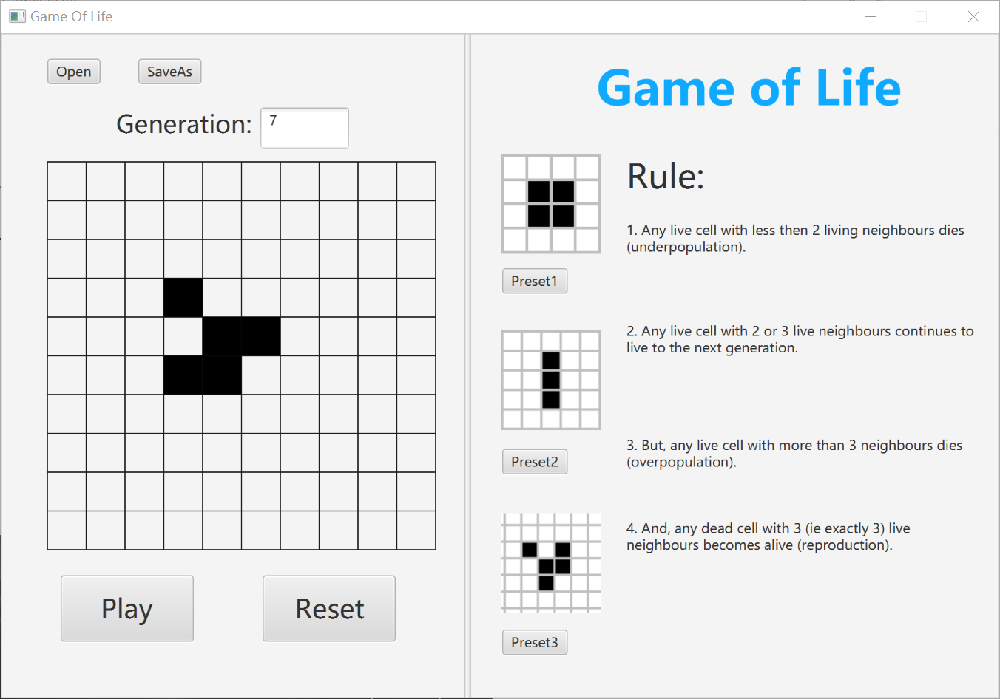

# Game Of Life :video_game:
This is just an exercise game for learning **javafx**.

I have to say that we are only half way to complete the logic and the GUI of the game, but this satisfy the requirement anyway.

By the way, I am using IDE `Eclipse Neon` and `Scene Builder 2.0` to develop this project. If the code cannot work for `IDEA`, then it's a pity.

Here is the ugly GUI I have made:

## Features

Most are requirements for the exercise:

- Hit `Play` to see the next generation
- Hit `Reset` to go back to clear and initialize the board
- Hit `Preset` buttons to preset the pattern
- Open or save the current status using `.xml` files